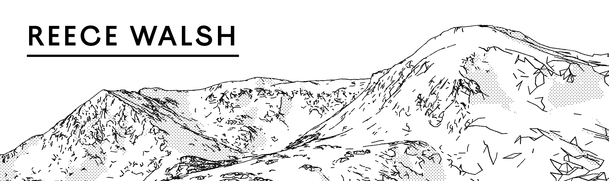

---

Hey, I'm Reece 👋 and thanks for stopping by!

I'm a graduate student currently studying at the University of British Columbia (UBC). My interests and research lie in teaching computers about the real world through images and video. Currently, I'm focusing on training a computer to understand something from very few examples, AKA few-shot learning.

## Connect

 - 👨‍💼 [LinkedIn](https://www.linkedin.com/in/reece-walsh-742893221/)
 - 👨‍💻 GitHub (You are here)
 - More ways to connect are available on [my personal website](https://reecewal.sh/about-me)

## Interests

- Computer Vision-based Machine Learning
- Task Automation
- Web Technology Exploration
- Computer Graphics

## Technologies & Tools

